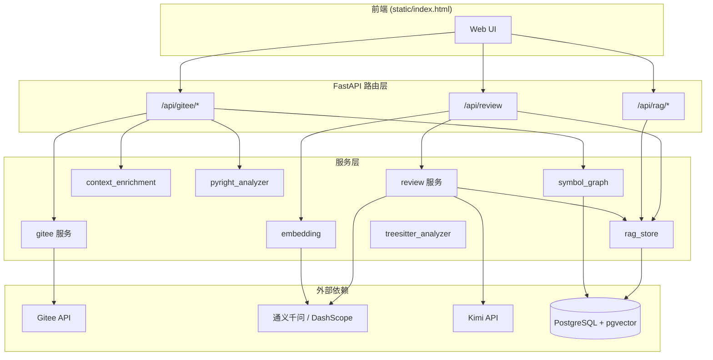
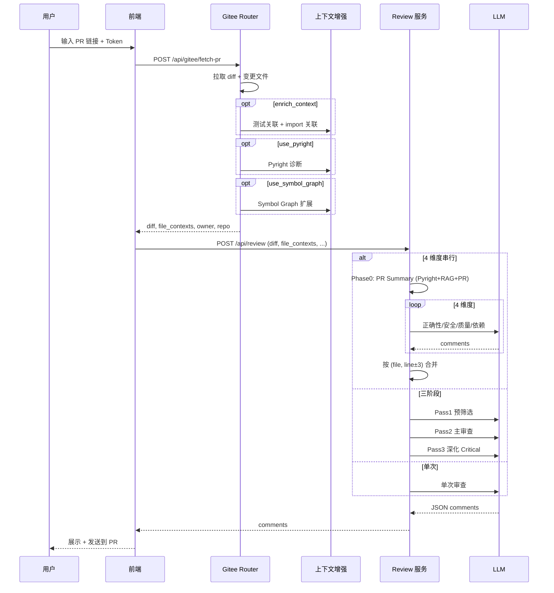
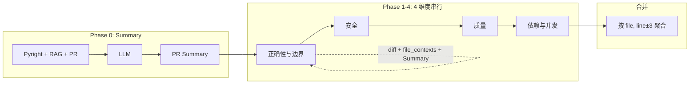

# AI PR Review 项目架构

## 1. 系统总览



---

## 2. 核心数据流



---

## 3. 4 维度串行审查 pipeline



---

## 4. 上下文增强流程

```mermaid
flowchart TB
    subgraph Input["输入"]
        PR[PR 元数据]
        Files[变更文件列表]
        Diff[diff]
    end

    subgraph Enrich["上下文增强 (可选)"]
        Test[测试文件关联<br/>test_* / *_test.py]
        Import[Import 关联<br/>Python ast / JS 正则]
        TS[Tree-sitter<br/>变更类型 + 符号]
        Pyright[Pyright<br/>类型诊断]
        Symbol[Symbol Graph<br/>caller/callee]
        Semantic[语义检索<br/>diff → Top-5 片段]
    end

    subgraph Output["输出"]
        FC[file_contexts<br/>Dict[path, content]]
    end

    PR --> Test
    Files --> Test
    Files --> Import
    Files --> TS
    TS --> Pyright
    Files --> Symbol
    Diff --> Semantic
    FC --> Semantic

    Test --> FC
    Import --> FC
    Pyright --> FC
    Symbol --> FC
    Semantic --> FC
```

---

## 5. 目录结构

```
prreview/
├── app/
│   ├── main.py              # FastAPI 入口
│   ├── routers/
│   │   ├── gitee.py         # fetch-pr, post-comment
│   │   ├── review.py        # 统一审查入口
│   │   └── rag.py           # RAG index / search
│   ├── services/
│   │   ├── gitee.py         # Gitee API 封装
│   │   ├── review.py        # LLM 审查、4 维度、三阶段
│   │   ├── context_enrichment.py  # 测试/import 关联
│   │   ├── embedding.py     # 语义检索
│   │   ├── pyright_analyzer.py
│   │   ├── treesitter_analyzer.py
│   │   ├── symbol_graph.py  # PostgreSQL caller/callee
│   │   └── rag_store.py     # pgvector 索引与检索
│   └── storage/
│       ├── db.py            # 数据库连接
│       ├── init_db.py       # 建表
│       ├── models.py        # Symbol Graph 模型
│       └── rag_models.py    # RAG 模型
├── static/
│   └── index.html           # 前端
├── scripts/
│   ├── run_review_and_report.py   # 真实 PR 审查 + 报告
│   ├── test_review_local.py       # 本地模拟审查
│   └── compute_catch_ratio.py     # Catch 比率计算
├── docs/
│   └── architecture.md      # 本文档
└── requirements.txt
```

---

## 6. 审查模式对比

| 模式 | 触发条件 | LLM 调用次数 | 特点 |
|------|----------|--------------|------|
| 单次 | `use_dimension_review=false` | 1 | 快，成本低 |
| 三阶段 | `use_multipass=true` | 2-3 | Pass1 预筛选 → Pass2 主审 → Pass3 深化 Critical |
| 4 维度 | `use_dimension_review=true`（默认） | 5 (1 Summary + 4) | Phase0 Summary → 4 维度串行 → 合并 |
